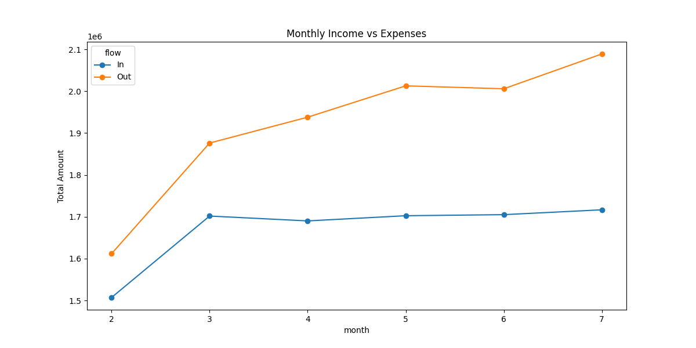
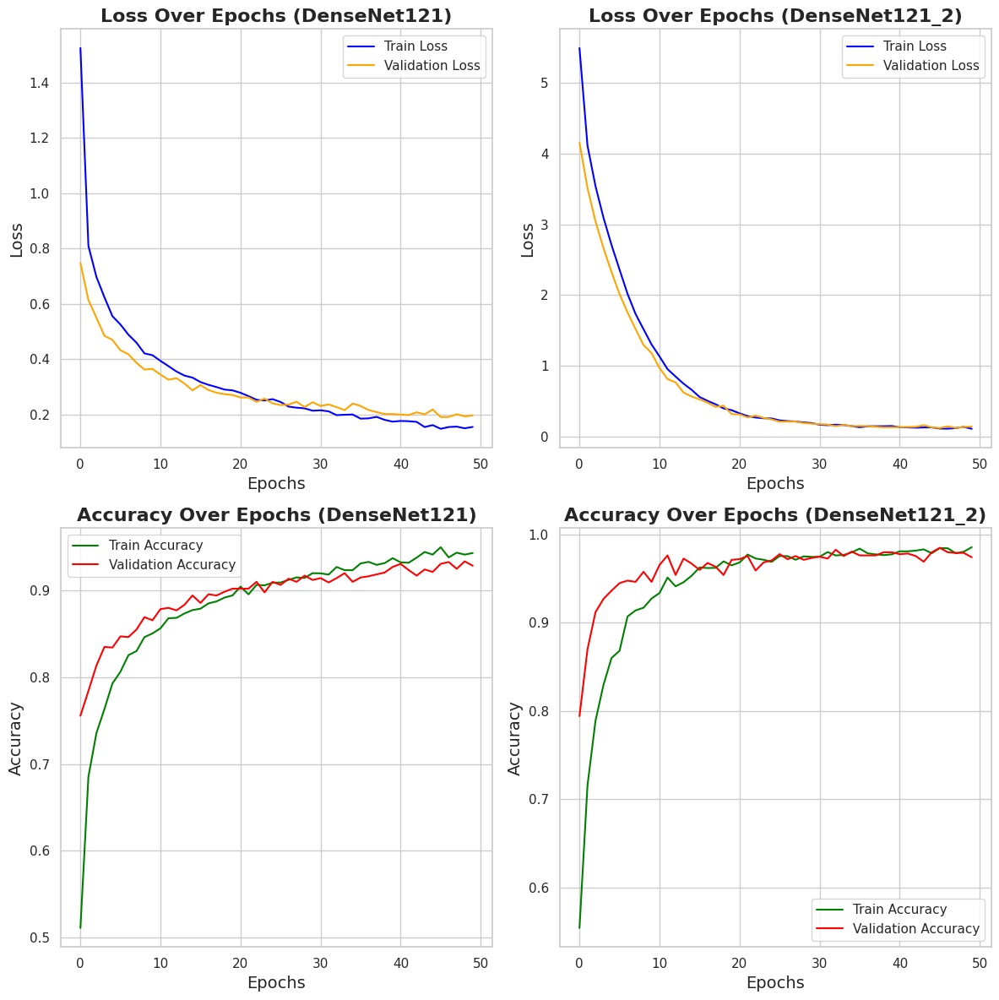
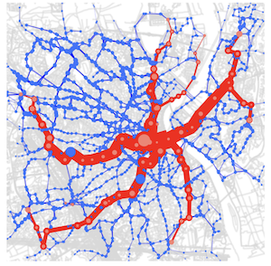
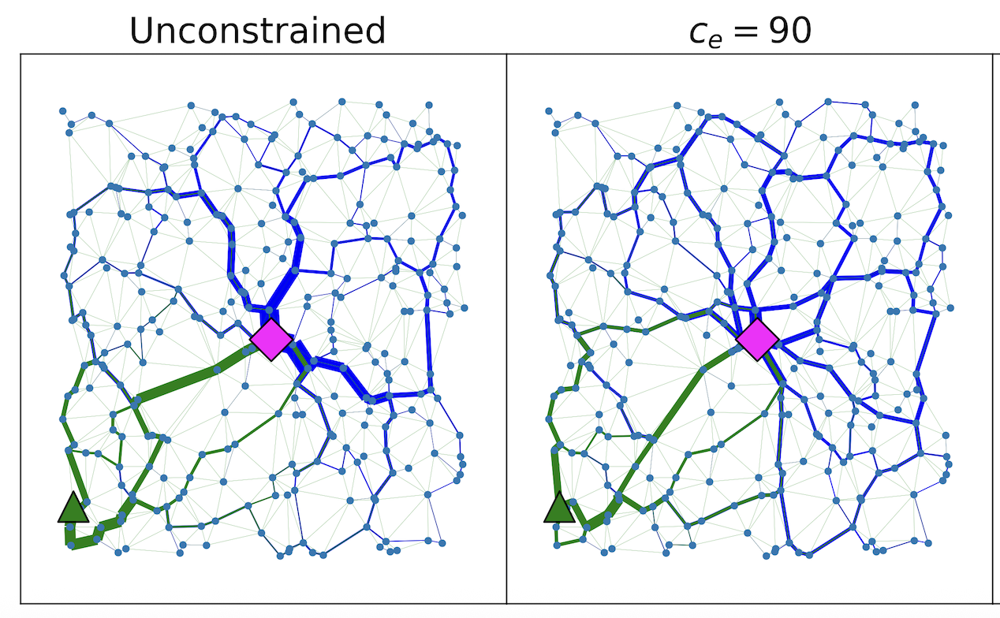
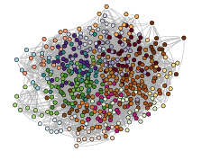

  <!-- 1. Income Pipeline -->
  

    

      <h3 style="margin:0 0 10px; color:#2c3e50;">Income & Expenses Forecasting Pipeline</h3>
      
        Python
        XGBoost
        SHAP
        FastAPI
        Docker
      <a href="https://github.com/aadinoyiibrahim/income" target="_blank" style="color:#0066cc; font-weight:600;">GitHub →</a>
    

  

  <!-- 2. Brain Tumor -->
  

    

      <h3 style="margin:0 0 10px; color:#2c3e50;">Brain Tumor Classification </h3>
      
        PyTorch
        DenseNet121
        Grad-CAM
        Streamlit
        Docker
      <a href="https://github.com/aadinoyiibrahim/brain-tumor-classification" target="_blank" style="color:#0066cc; font-weight:600;">GitHub →</a>
    

  

  <!-- 3. MultiOT -->
  

    

      <h3 style="margin:0 0 10px; color:#2c3e50;">MultiOT</h3>
      
        Python
        NetworkX
        SciPy
        Flows
        Optimization
      <a href="https://github.com/aadinoyiibrahim/MultiOT" target="_blank" style="color:#0066cc; font-weight:600;">GitHub →</a>
    

  

  <!-- 4. VECOTRA -->
  

    

      <h3 style="margin:0 0 10px; color:#2c3e50;">VECOTRA</h3>
       
      NetworkX
        SciPy
        Flows
        Python
        Constrained dynamics
      <a href="https://github.com/aadinoyiibrahim/VECOTRA" target="_blank" style="color:#0066cc; font-weight:600;">GitHub →</a>
    

  

  <!-- 5. ORC-Nextrout -->
  

    

      <h3 style="margin:0 0 10px; color:#2c3e50;">ORC-Nextrout</h3>
       
        Python
        NetworkX
        SciPy
        Community detection
        Optimal transport
      <a href="https://github.com/aadinoyiibrahim/ORC-Nextrout" target="_blank" style="color:#0066cc; font-weight:600;">GitHub →</a>
    

  

